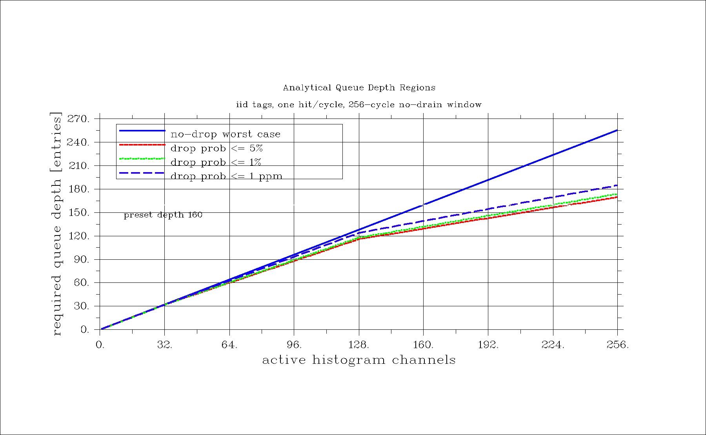
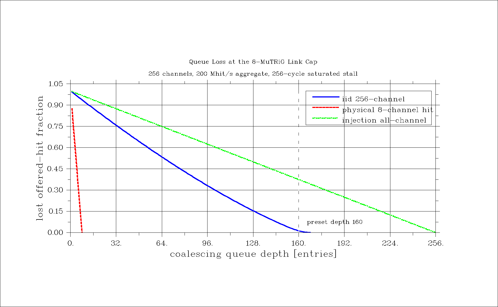
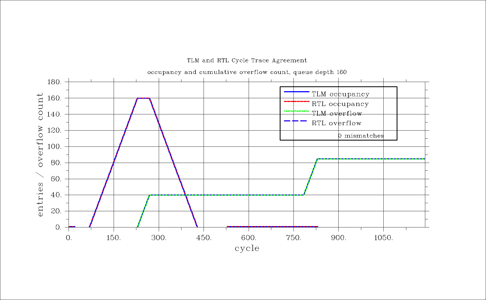

# histogram_statistics coalescing queue model report

Date: 2026-04-25

This report is the inline presentation for the first
`histogram_statistics_v2` coalescing-queue modeling gate. The evidence stack is
analytical model, executable TLM, then RTL simulation. No board evidence is
claimed here.

Source RTL: [`../rtl/coalescing_queue.vhd`](../rtl/coalescing_queue.vhd)

Model contract:

- one post-divider hit can arrive per clock;
- one queued element can drain per clock when `i_drain_ready=1`;
- queue entries are histogram-bin tags;
- each queued tag has an 8-bit saturating kick counter;
- repeated hits to a queued tag coalesce by incrementing `kick_count`;
- a new tag allocates one queue slot;
- overflow is either queue-full/new-tag or kick-counter saturation.

## Set 1: Analytical Queue Depth Regions



Data:
[`artifacts/queue_depth_quantiles_8mutrig.csv`](artifacts/queue_depth_quantiles_8mutrig.csv)

For iid traffic over `m` active channels, let `D_t` be the number of distinct
tags seen during a no-drain window after `t` cycles. With per-cycle hit
probability `p`, the exact occupancy distribution follows
$P_{t+1}(k)=P_t(k)(1-p+p k/m)+P_t(k-1)p(m-k+1)/m$. The queue-full
probability at depth `d` is $P_{\mathrm{full}}(d)=\Pr[D_T>d]$, so the depth for
a target tail probability is
$d_\epsilon=\min\{d:P_{\mathrm{full}}(d)\le\epsilon\}$.

Sanity check: this is the right abstraction for queue-slot sizing because
coalescing makes queue occupancy depend on distinct tags, not raw hit count.
For `T=256`, `p=1`, and `m=256`, the worst-case no-drop depth is 256, but the
1 ppm iid tail depth is 185. The default depth 160 is therefore not a
1 ppm-safe all-channel iid stall depth, although it covers localized 8-channel
physical hits.

Key analytical rows at `T=256`, `p=1`:

| active channels | no-drop depth | depth at <= 1 ppm queue-full probability |
|---:|---:|---:|
| 1 | 1 | 1 |
| 8 | 8 | 8 |
| 32 | 32 | 32 |
| 128 | 128 | 124 |
| 256 | 256 | 185 |

## Set 2: Loss Fraction at the 8-MuTRiG Link Cap



Data:
[`artifacts/queue_loss_vs_depth_8mutrig.csv`](artifacts/queue_loss_vs_depth_8mutrig.csv)

This plot uses the physical link cap requested for 8 MuTRiG inputs:
`8 * 25 Mhit/s = 200 Mhit/s` aggregate, 256 histogram channels, and a saturated
256-cycle no-drain window. The y-axis is lost offered-hit fraction, not just
the probability that the queue ever became full.

The iid curve is computed from the same distinct-tag recurrence while
accumulating expected lost hits. In compact form,
$L_{\mathrm{iid}}(d)=\mathbb{E}[\mathrm{lost\ hits\ during\ }T\mathrm{\ cycles}]/(Tp)$.
The deterministic traffic bounds are $L_{\mathrm{phys}}(d)=\max(0,(8-d)/8)$ for
an 8-channel physical cluster and $L_{\mathrm{inj}}(d)=\max(0,(256-d)/256)$ for
all-channel injection.

Sanity check: the iid queue-full probability and the iid lost-hit fraction are
different metrics. At depth 160, the all-256 iid queue-full probability during
the stall is about 61.9%, but the expected lost-hit fraction is about 1.27%,
because many later hits land on tags already in the coalescing queue. That
makes sense and should not be read as a contradiction. In contrast, all-channel
injection is adversarial and still loses 37.5% at depth 160.

Selected values:

| queue depth | iid 256-channel | physical 8-channel hit | injection all-channel |
|---:|---:|---:|---:|
| 8 | 0.93805440291 | 0 | 0.96875 |
| 160 | 0.0127214992353 | 0 | 0.375 |
| 185 | 0.00000000573193 | 0 | 0.27734375 |
| 256 | 0 | 0 | 0 |

## Set 3: TLM and RTL Cycle Agreement



Artifacts:

- [`artifacts/queue_trace_stimulus.csv`](artifacts/queue_trace_stimulus.csv)
- [`artifacts/queue_trace_expected_tlm.csv`](artifacts/queue_trace_expected_tlm.csv)
- [`artifacts/queue_trace_observed_rtl.csv`](artifacts/queue_trace_observed_rtl.csv)
- [`artifacts/queue_trace_compare.csv`](artifacts/queue_trace_compare.csv)

The executable TLM uses the RTL state update order. Queue occupancy evolves as
$q_{t+1}=q_t+I[\mathrm{new\ tag\ accepted}]-I[\mathrm{drain\ fire}]$, while a
repeated hit to a queued tag updates $kick_b(t+1)=\min(kick_b(t)+1,255)$.
Overflow increments when a new tag arrives with no queue slot available, or
when a queued tag is hit after its kick counter is already saturated.

The comparison metric is
$N_{\mathrm{mismatch}}=\sum_t I[y_{\mathrm{TLM}}(t)\ne y_{\mathrm{RTL}}(t)]$.

Result:

```text
QuestaSim-64 2026.1_1
vcom: Errors 0, Warnings 0
vsim: Errors 0, Warnings 0
TLM/RTL comparison PASS: 1190 cycles, 0 mismatches
```

Sanity check: this trace proves that the current TLM matches the RTL for the
targeted coalescing, queue-full, kick-saturation, and drain sequences in this
gate. It is not a full randomized DV closure claim.

## Figure Quality Gate

DISLIN renderer: [`scripts/render_queue_plots.sh`](scripts/render_queue_plots.sh)

All presentation PNGs are rendered at `1800 x 1112`, giving an aspect ratio of
`1.619`, within rounding of the golden ratio. SVG versions are generated from
the same renderer:

- [`artifacts/queue_depth_quantiles_8mutrig.svg`](artifacts/queue_depth_quantiles_8mutrig.svg)
- [`artifacts/queue_loss_vs_depth_8mutrig.svg`](artifacts/queue_loss_vs_depth_8mutrig.svg)
- [`artifacts/queue_trace_tlm_rtl_match.svg`](artifacts/queue_trace_tlm_rtl_match.svg)

DISLIN 11.5.2 reported zero warnings for PNG and SVG renders. The final visual
pass checked that axes are readable, legends do not cover data, line styles are
visible when TLM and RTL traces overlap, and title/axis text is not clipped.
